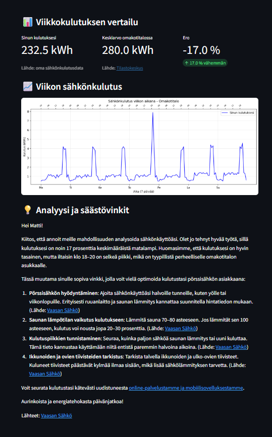
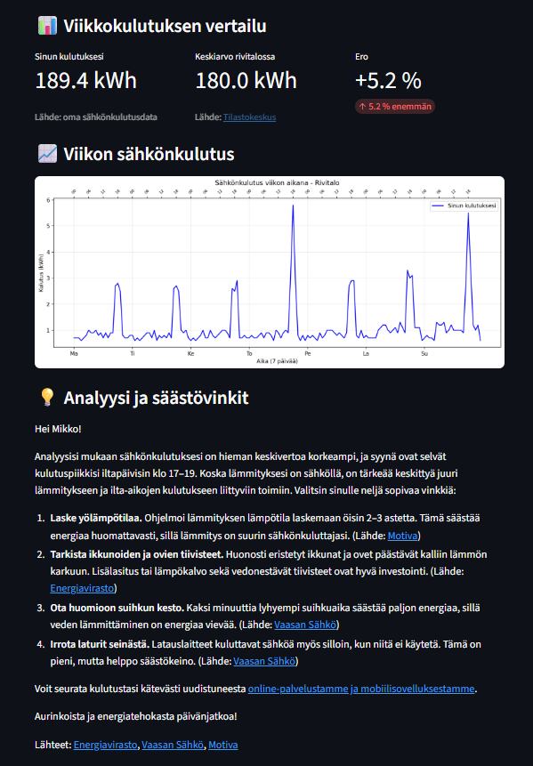

# ⚡ Energianeuvonantaja – tekoälypohjainen energianeuvontapalvelu

## 1. Projektin kuvaus

Palvelu analysoi asiakkaan sähkönkulutusta (7 päivän tuntidata), vertaa sitä Tilastokeskuksen pyöristettyyn keskiarvoon asumismuodon mukaan ja antaa henkilökohtaisia, lähdeperusteisia säästövinkkejä asiakkaalle hänen profiilinsa mukaan. Tekoäly (DeepSeek) hoitaa analyysin ja personoinnin, mutta vinkit on erotettu omaan tietopohjaansa (`tips.json`), jotta tekoälyn hallusinaatioilta vältytään. Palvelu on toteutettu Streamlitillä ja se on suunnattu kuluttajille.

## 2. Teknologiat ja perustelut

**Python 3.10** – Laajasti käytetty ja kehitetty, hyvä yhteensopivuus tekoäly- ja data-analyysityökalujen kanssa.

**Streamlit** - Nopeuttaa sovelluksen prototypointia ja demonstrointia yhdistämällä UI:n ja logiikan ilman tarvetta erilliselle frontend-kehitykselle. 

**DeepSeek API** - Tekoälyanalyysiin sekä pääasiallinen LLM-malli projektissa. Hyvä suomen kielen tuki, edullinen ja rajapinta yhteensopiva OpenAI:n kanssa. Voidaan vaihtaa toiseen malliin ilman koodimuutoksia.

**Matplotlib** - Yksinkertainen kirjasto viikkokulutuskuvaajan piirtoon analyysissä.

**JSON** - Tietopohjan tallennukseen. Huomattavasti nopeampi tapa saada tallennetua simuloitua dataa esim. kulutuksesta ja asiakasprofiileista demonstraatiota varten kuin toteuttaa oikea tietokanta. Korvattaisiin oikealla tietokannalla (GDPR huomioiden) tulevaisuudessa. Sopii hyvin demonstraation suhteellisen pieneen datamäärään.

**python-dotenv** - API-avaimen hallintaan ympäristömuuttujissa.

**requests** - DeepSeek API-kutsuihin, kevyempi vaihtoehto kuin openai-kirjasto.

**logging** (oma logger.py) - Lokitukseen sovellukseen toimintaa ja virheiden seurantaa varten. Helpottaa huomattavasti projektin kehittämistä.

## 3. Miten sovellus toimii

Sovellus on rakennettu modulaariseksi ja se toimii seuraavasti:

**1. Käyttäjä valitsee asiakkaan** (Matti, Laura, Mikko, Jukka, Sari)

Valinta tapahtuu Streamlitin selectbox-komponentilla.

**2. Sovellus lataa tiedot**

data_loader.py hakee valitun asiakkaan kulutusdatan (data/consumption_<nimi>.json) ja profiilitiedot (data/profiles.json).

Kulutusdata sisältää 7 päivän satunnaiset tuntikohtaiset sähkönkulutukset (mock-data). Satunnaisuutta on rajattu realismiin pyrkien (generate_weekly_data.py).

Profiili sisältää asumismuodon, lämmitystavan, ilmalämpöpumpun, sähköauton, mökin, saunan ja pörssisähkön käytön.

**3. Tekoäly (DeepSeek) analysoi kulutuksen**

analyzer.py laskee asiakkaan viikkokulutuksen ja vertaa sitä pyöristettyyn Tilastokeskuksen keskiarvoon asumismuodon perusteella.

Tiedot lähetetään DeepSeekille promptin avulla, joka pyytää tunnistamaan kolme suurinta kulutuspiikkiä, tarkastelemaan yökulutusta (23-05) ja kommentoimaan vertailua Tilastokeskuksen keskiarvoon.

Tekoäly palauttaa analyysin tekstinä.

**4. Vinkkien suodatus ja valinta**

tip_retriever.py suodattaa tips.json:n vinkit asiakkaan profiilin perusteella (esim. jos asiakkaalla ei ole sähköautoa, sähköautovinkit jätetään pois). Vinkkikategorioita on yhteensä 14 ja yhteensä vinkkejä 34.

Suodatuksen jälkeen vinkit ryhmitellään kategorioittain ja valitaan korkeintaan 6 eri kategoriaa (kerrostettu otanta). Kustakin kategoriasta poimitaan yksi satunnainen vinkki. Tällä varmistetaan, että asiakas saa monipuolisia neuvoja heille sopivilta aihealueilta.

**5. Lopullisen vastauksen muodostus**

app.py rakentaa uuden promptin, jossa tekoäly saa profiilin, analyysin ja valitut vinkit.

Tekoälyä pyydetään valitsemaan korkeintaan neljä vinkkiä kerrostetusta otannasta ja kirjoittamaan henkilökohtainen, ystävällinen vastaus (max 8 virkettä).

Vastaus muotoillaan niin, että jokaisen vinkin perässä on (Lähde: Nimi, URL), ja nämä muunnetaan HTML-linkeiksi, jotta lähteet ovat varmistettavissa.

**6. Tulosten esittäminen**

Streamlit näyttää:

Viikkokulutuksen vertailu – kolme mittaria (sinun kulutuksesi dataan perustuen, keskiarvo asumismuodossa, ero prosentteina), lähdeviittauksella Tilastokeskukseen.

Kuvaaja – käyttäjän viikon tuntikulutus (kellonajat 0,6,12,18 merkitty toiselle akselille).

Tekoälyn analyysi ja vinkit – klikattavat lähdelinkit.

Lähdeluettelo – pääsivujen linkit analyysissä käytetyille lähteille.

**7. Lokitus**

logger.py tallentaa jokaisen analyysin tapahtumat (event-id, valitut vinkit, virheet) tiedostoon logs/-kansioon ja tulostaa ne myös IDE:n (VS Code) terminaaliin.

## 4. Arkkitehtuuri (modulaarinen)

```bash
energianeuvonta/
├── app.py # Streamlit-käyttöliittymä
├── generate_weekly_data.py # Skripti mock-datan luontiin (7 päivää)
├── requirements.txt # Riippuvuudet
├── .env # DEEPSEEK_API_KEY (ei versionhallinnassa)
├── .env.example # Mallitiedosto API-avaimelle (versionhallinnassa)
├── .gitignore
├── README.md
│
├── images/ # Kuvakaappauksia analyyseistä
│
├── modules/
│ ├── __init.py__
│ ├── data_loader.py # Lataa kulutusdatan ja profiilit
│ ├── llm_interface.py # Abstrakti LLM + DeepSeek-toteutus (vaihdettavissa)
│ ├── analyzer.py # Kulutusanalyysi + vertailu Tilastokeskukseen
│ ├── tip_retriever.py # Suodatus ja kerrostettu otanta vinkeistä
│ └── logger.py # Lokitus (tiedostoon ja konsoliin)
│
├── data/
│ ├── consumption_matti.json # 5 asiakkaan 7 vrk tuntidata
│ ├── consumption_laura.json
│ ├── consumption_mikko.json
│ ├── consumption_jukka.json
│ ├── consumption_sari.json
│ ├── profiles.json # Asiakkaiden profiilit (lämmitys, auto, mökki, sauna, pörssisähkö)
│ └── tips.json # 34 vinkkiä 4 lähteestä (Motiva, Vaasan Sähkö, Energiavirasto, Tilastokeskus)
│
└── logs/ # (ei versionhallinnassa)
  └── YYYY-MM-DD.log # Päiväkohtainen lokitiedosto (automaattisesti luotu)
```

**Lokit:** Jokaiselle päivälle luodaan oma tiedosto (esim. `2025-04-15.log`), joka tallentuu `logs/`-kansioon. Lokit sisältävät aikaleimat, tapahtumat, virheet ja event ID:t kyseiseltä päivältä.

## 5. Asennus ja käyttö

**1. Kloonaa tai lataa projekti**

**2. Avaa terminaali projektin juuressa**

**3. Luo virtuaaliympäristö ja aktivoi se**  

```bash
python -m venv venv
```

**Windows**
```bash
venv\Scripts\activate
```
**Mac/Linux**
```bash
source venv/bin/activate
```

**4. Asenna riippuvuudet**

```bash
pip install -r requirements.txt
```

**5. Luo .env-tiedosto ja lisää DeepSeek API -avain**
```bash
DEEPSEEK_API_KEY=sk-tästä_avain
```

**6. Generoi mock-data (tarvittaessa)**

```bash
python generate_weekly_data.py
```

**7. Käynnistä sovellus**

```bash
streamlit run app.py
```

## 6. Tietolähteet ja vinkkien keruu

Kaikki vinkit on poimittu julkisista suomalaisista lähteistä:

**Motiva** – energianeuvonnan materiaalit (https://www.motiva.fi/)

**Vaasan Sähkö** – energiavinkit ja palvelukuvaukset (https://www.vaasansahko.fi/)

**Energiavirasto** – kuluttajaohjeet (https://energiavirasto.fi/etusivu)

**Tilastokeskus** – kotitalouksien energiankulutustilastot (https://stat.fi/fi)

Jokaisella vinkillä on oma URL ja last_updated-päiväys (jos saatavilla). 34 vinkkiä on jaettu 14 kategoriaan (lämmitys, sähköauto, sauna, kodinkoneet, jne.).
Vertailuarvot viikkokulutukselle (kerrostalo 100 kWh, rivitalo 180 kWh, omakotitalo 280 kWh) perustuvat Tilastokeskuksen asumisen energiankulutustilastoon (https://stat.fi/fi/tilasto/asen). Luvut on pyöristetty havainnollisuuden vuoksi.

## 7. Haasteet ja ratkaisut (sekä hyväksytyt rajoitteet)

**1. Tekoälyn hallusinaatioiden estäminen**

Tekoälyllä on taipumus keksiä omia "järkeviä" vinkkejä, jotka eivät perustu luotettaviin lähteisiin.

Ratkaisu: Vinkit erotettiin staattiseksi JSON-tietopohjaksi (tips.json). Tekoäly valitsee ja personoi vinkit, mutta ei koskaan lisää uusia neuvoja. Jokaisen vinkin mukana tulee lähdeviite.

**2. Saman aiheen vinkkien päällekkäisyys**

Kaksi samaa aihetta käsittelevää vinkkiä (esim. ilmalämpöpumppu) saattoi valikoitua, koska ne olivat eri kategorioissa ("ilmalämpöpumppu" ja "lämmitys").

Ratkaisu: Ongelma tunnistettu, mutta konfliktiryhmien hallintaa (esim. vinkit 3 ja 9 eivät saisi olla samanaikaisesti) ei ehditty toteuttaa. Tämä on hyväksytty rajoite demossa, sillä ongelma rajoittuu tässä projektissa vain näihin kahteen kyseiseen vinkkiin (3 ja 9).

**3. Lokeissa näkyvä "liian monta vinkkiä" -varoitus**

extract_used_sources tunnistaa käytetyt vinkit lähteen perusteella. Jos vastauksessa mainitaan "Motiva", kaikki Motivan vinkit merkitään valituiksi. Ongelma korostui, koska tekoälyn tuottamissa vastauksissa lähdeviitteet olivat HTML-linkkejä.

Ratkaisu: Parannettiin funktiota poistamaan HTML-tagit ennen vertailua (clean_text = re.sub(r'<[^>]+>', '', text)), jotta lähdenimi löytyy oikein. Tarkempi vinkkikohtainen tunnistus (otsikon tai sisällön perusteella) jätettiin kuitenkin toteuttamatta aikataulusyistä. Lokeissa näkyy tekoälyn valitsevan aina kaikki kuusi saatavilla olevista vinkeistä, mutta vain neljä päätyy analyysiin. Tämä on hyväksytty rajoite, koska se ei vaikuta loppukäyttäjän kokemukseen.

**4. Vertailu Tilastokeskuksen dataan**

Puuttui konkreettinen vertailu oman kulutuksen ja Tilastokeskuksen keskiarvon välillä.

Ratkaisu: Lisättiin analyzer.py:hen vertailulaskenta ja app.py:hen visuaaliset mittarit (kolme korttia). Kuvaajaan lisättiin toinen akseli kellonajoille. Vertailuarvot ovat pyöristettyjä havainnollisuuden vuoksi.

**5. Tekoälyn lämpötila (temperature)**

Matala lämpötila (0.0-0.1) tekee vastauksista jäykkiä mutta luotettavia. Korkeampi lämpötila toisi teoriassa luonnollisuutta tekstiin mutta lisäsi hallusinaatioiden riskiä huomattavasti (0.3-0.5).

Ratkaisu: Valittu temperature=0.2 on tietoinen kompromissi luotettavuuden ja luonnollisuuden välillä.

**6. API-kutsujen epävarmuus ja aikakatkaisut (ReadTimeoutError)**

DeepSeek API ei aina ehdi vastata 30 sekunnin aikana (palvelimen ruuhka, hidas verkkoyhteys, raskas pyyntö). Virhe on erittäin harvinainen eikä toistu systemaattisesti.

Ratkaisu: Lisätty timeout=30 ja virheenkäsittely (try-except). Tämä on hyväksytty rajoite, koska demonstraatiota ei skaalata tuotantokäyttöön eikä harvinaisia virhetilanteita ole mielekästä korjata tässä vaiheessa. Tuotannossa voitaisiin toteuttaa uudelleenyritykset (retry-logic), asynkroniset kutsut tai pyynnön keventäminen.

**7. Suorituskyky**

DeepSeek API voi olla hidas ensimmäisessä kutsussa, ja pitkä prompt (paljon vinkkejä ja dataa) hidastaa vastausta.

Ratkaisu: Tuotannossa voitaisiin käyttää välimuistia, asynkronista käsittelyä tai keventää promptia (vähemmän vinkkejä).

**8. Tekoälyn tuottamat pienet kirjoitus- ja sanamuotovirheet**

Tekoälyn vastauksissa esiintyi ajoittain pieniä kielioppivirheitä, kuten yhdyssanavirheitä tai vääriä päätteitä. Nämä olivat satunnaisia eivätkä toistuneet systemaattisesti, mutta heikensivät hieman asiakaskokemusta.

Ratkaisu: Jatkokehityksessä kielioppivirheiden korjaamiseksi voitaisiin toteuttaa vastauksen jälkikäsittely (esim. käyttämällä toista kevyttä kielimallia oikolukuun) tai hienosäätää promptia antamaan vielä tarkempia ohjeita suomen kielen rakenteesta (esim. "varmista yhdyssanojen oikeinkirjoitus" ja "tarkista lauseiden loogisuus"). Demonstraatiossa nämä satunnaiset virheet hyväksyttiin, koska ne eivät vaikuttaneet vinkkien ymmärrettävyyteen.

## 8. Jatkokehitysideat

**1. Oikea API-integraatio** – korvataan mock-data Vaasan Sähkön asiakasdatalla (GDPR huomioiden).

**2. Kyselylomake** – ennen analyysiä käyttäjä vastaa kyllä/ei-kysymyksiin (esim. omistatko ilmalämpöpumpun, sähköauton, mökin). Näiden tietojen pohjalta tekoäly voi tehdä entistä tarkempia suosituksia.

**3. Vektoritietokanta (esim. Chroma) ja semanttinen haku** – Nykyinen avainsanahaku etsii täsmällisiä sanoja (esim. "lataus"), mikä on rajoittunutta. Semanttisessa haussa vinkit muunnetaan numeerisiksi vektoreiksi (embedding), ja haku perustuu merkityksen samankaltaisuuteen. Esimerkiksi "sähköauton lataus" löytäisi vinkit, jotka käsittelevät latausta, vaikka niissä ei olisi kyseistä sanaa. Tämä parantaa osumatarkkuutta ja vähentäisi manuaalisen avainsanalistan ylläpitoa.

**4. Reaaliaikaiset pörssisähkön hinnat** – voitaisiin ehdottaa esimerkiksi sähköautolatauksen ajoitusta halvoille tunneille.

**5. Konfliktiryhmien toteutus** – estetään päällekkäiset vinkit myös otsikkotason samankaltaisuuden perusteella.

**6. Sähkösopimussuositukset** – esimerkiksi jos kulutus painottuu yöhön, ehdotetaan pörssisähköä; jos tasainen, kiinteää hintaa.

**7. Mobiilisovellus** – nykyinen Streamlit toimisi pohjana.

**8. Vaikutuspohjainen vinkkien painotus** – vinkeille annetaan painokerroin niiden todellisen säästöpotentiaalin mukaan (esim. sähköauton latauksen ajoitus > LED-lamput). Tekoäly priorisoi suuremman vaikutuksen vinkkejä. Toteutus esimerkiksi lisäämällä `impact_score`-kenttä `tips.json`:iin (arvot 1-10) ja ohjaamalla tekoälyä painottamaan korkeamman pistemäärän vinkkejä.

## 9. GitIgnore

**Virtual environment**
venv/
env/
ENV/

**Python cache**
__pycache__/
*.pyc
*.pyo
*.pyd

**API keys and secrets**
.env
.env.local
.env.*.local

**Logs**
logs/
*.log

**Streamlit**
.streamlit/

**IDE**
.vscode/
.idea/

**OS generated files**
.DS_Store
Thumbs.db

## 10. Kuvakaappauksia

Kaikki projektissa esiintyvät käyttäjät ovat kuvitteellisia ja heidän datansa on simuloitua.

<table>
  <tr>
    <td align="center">
        
        <br><strong>Kuva 1:</strong> Matin analyysi
    </td>
    <td align="center">
        
        <br><strong>Kuva 2:</strong> Mikon analyysi
    </td>
  </tr>
</table>

## 11. Tekijä ja kiitokset

Projekti on tehty osana digiharjoittelijan esitehtävää Vaasan Sähkölle.
Kiitokset Motivalle, Energiavirastolle, Tilastokeskukselle ja Vaasan Sähkölle julkisista materiaaleista.

**Yhteystiedot**
Eemil Hytönen - hytoneneemil@gmail.com - https://github.com/EemilHytonen